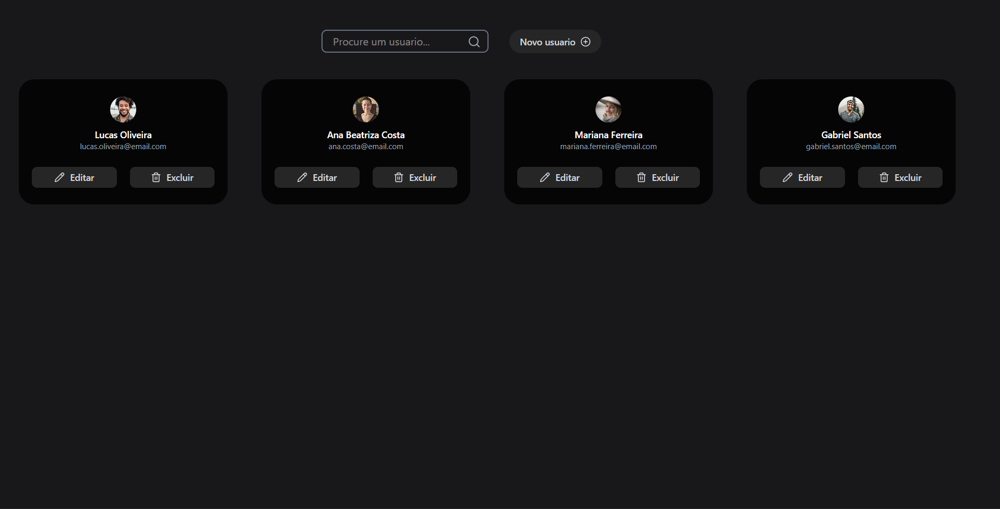

# CRUD de Usuários

Aplicação CRUD desenvolvida para gerenciar usuários, permitindo cadastrar, listar, editar e excluir registros. O projeto possui uma API desenvolvida com Node.js, Express e Prisma ORM, integrada ao PostgreSQL (Supabase), além de uma interface construída com React.

## Preview



---

## Funcionalidades

- Cadastro de usuários
- Listagem de usuários
- Pesquisa por nome
- Atualização de usuários
- Exclusão de usuários
- Upload de avatar
- Preview da imagem antes do envio
- Loading durante a exclusão
- Atualização automática da lista após criar, editar ou excluir um usuário
- Avatar padrão caso a imagem não seja encontrada
- Validação de e-mail

---

## Tecnologias

### Front-end

- React
- Vite
- JavaScript
- Tailwind CSS
- Lucide React

### Back-end

- Node.js
- Express
- Prisma ORM

### Banco de Dados

- PostgreSQL (Supabase)

---

## Instalação

Clone o repositório:

```bash
git clone https://github.com/Anaelica/cadastro-de-usuarios.git
```

Entre na pasta do projeto:

```bash
cd cadastro-de-usuarios
```

Instale as dependências:

```bash
npm install
```

---

## Configuração da API

Crie um arquivo `.env` na raiz do projeto e adicione sua conexão com o banco de dados:

```env
DATABASE_URL="sua_string_de_conexao"
```

Execute as migrations do Prisma:

```bash
npx prisma migrate dev
```

Caso queira visualizar o banco de dados:

```bash
npx prisma studio
```

Inicie a API:

```bash
npm run server
```

A API será executada em:

```text
http://localhost:3001
```

---

## Configuração do Front-end

Em outro terminal, inicie o React:

```bash
npm run dev
```

A aplicação ficará disponível em:

```text
http://localhost:5173
```

---

## Rotas da API

| Método | Endpoint | Descrição |
|---------|----------|-----------|
| GET | `/usuarios` | Lista todos os usuários |
| POST | `/usuarios` | Cria um novo usuário |
| PUT | `/usuarios/:id` | Atualiza um usuário |
| DELETE | `/usuarios/:id` | Remove um usuário |

---

## Aprendizados

Durante o desenvolvimento deste projeto foram praticados conceitos como:

- Componentização
- Hooks do React
- Consumo de APIs com Fetch
- Upload de arquivos utilizando FormData
- Comunicação entre componentes com Props
- Gerenciamento de estado
- CRUD completo
- Integração entre Front-end e Back-end
- Prisma ORM
- Manipulação de banco de dados
- Tratamento de erros
- Organização de componentes

---

## Autor

**Anaelica Barbosa**

GitHub: https://github.com/Anaelica